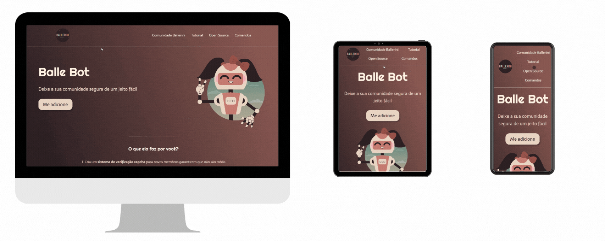

# LANDING PAGE WITH HTML & CSS

Balle Bot, a robot that moderates the Rafaella Ballerini community at the Discord.

This project was based on the design created and made available via Youtube by Rafaella.

⚒️ Technologies used:

- HTML
- CSS
- Figma: https://www.figma.com/file/myqP66iQwzjwjrIAJyyrip/BalleBot?node-id=0%3A1
- Youtube Video: https://www.youtube.com/watch?v=llF6vD-RljE&t=27s

🤓 Learning:

- Use of HTML tags
- Use of classes
- CSS Flexbox
- Use of external sources
- Improving the knowledge of responsiveness with @media

📄 Requirements:

- Any operating system
- VS Code
- Chrome

📝 License:

-Free for use and change

💻 Result:

